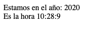

# Clase date

Javascript como lenguaje de programación implementa el paradigma Orientado a Objetos, por lo cual ya tiene algunas clases definidas por defecto.

La clase Date por ejemplo tiene la estructura necesaria para construir objetos que permiten hacer operaciones con fechas.

```javascript
var fecha = new Date();
fecha.getFullYear();
// Muestra el año actual
```

**NOTA:**
>De debe tener en cuenta la notación punto para accedes a los atributos y metodos

### Metodos

* `getFullYear()`Año (actual)
* `getHours()`Horas (actual)
* `getMinutes()` Minutos (actual)
* `getSeconds()`Segundos (actual)

### Reto


